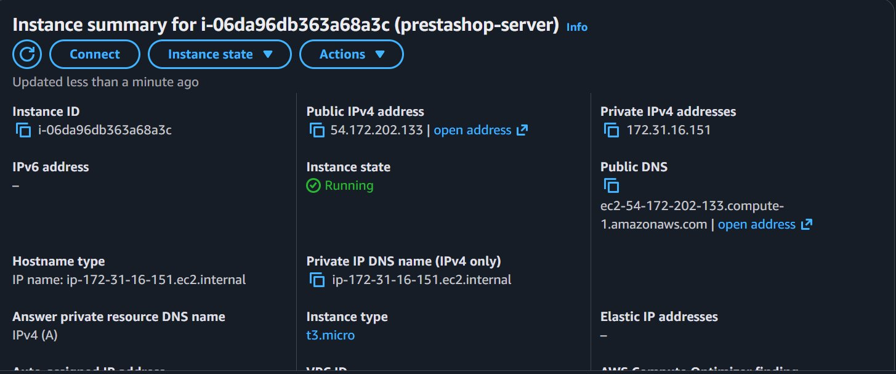
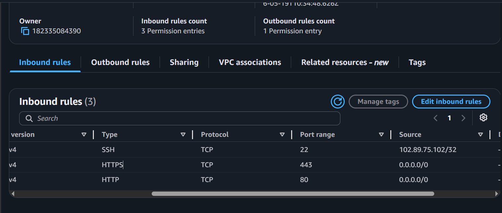
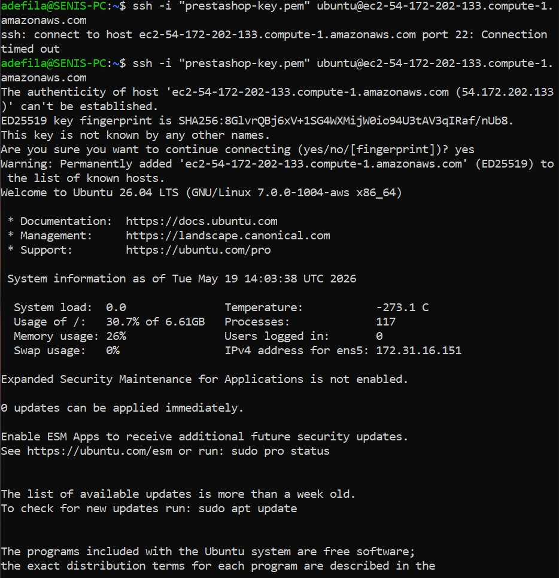
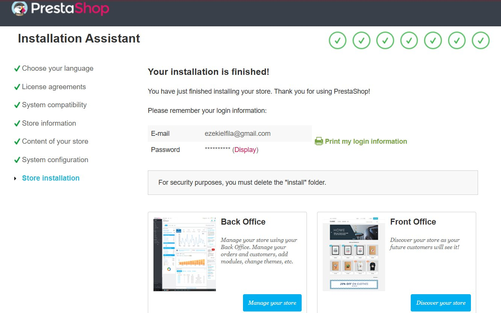

# 🛒 PrestaShop on AWS — Production Deployment


> A decoupled e-commerce infrastructure deployment on AWS, featuring a hands-on resolution of a cutting-edge PHP 8.5 compatibility challenge not yet documented in the official PrestaShop ecosystem.

---

## 📋 Table of Contents

- [Architecture Overview](#architecture-overview)
- [Infrastructure Specifications](#infrastructure-specifications)
- [Security Design](#security-design)
- [Deployment Walkthrough](#deployment-walkthrough)
- [⚠️ Technical Deep Dive: The PHP 8.5 Challenge](#️-technical-deep-dive-the-php-85-challenge)
- [Screenshots](#screenshots)
- [Key Learnings](#key-learnings)

---

## Architecture Overview

Traffic flows through a public-facing EC2 instance, which serves the PrestaShop application layer, while all database operations are handled by a privately isolated RDS instance — never directly exposed to the internet.

```
Internet
    │
    ▼
[ Public IPv4: 54.172.202.133 ]
    │  HTTP :80 / HTTPS :443
    ▼
┌─────────────────────────────────────────┐
│   AWS EC2 (i-06da96db363a68a3c)         │
│   Name: prestashop-server               │
│   Type: t3.micro  |  Ubuntu 26.04 LTS   │
│   Private IP: 172.31.16.151             │
│                                         │
│   Apache 2  ──►  PHP 8.5.4              │
│                      │                  │
│              PrestaShop App             │
└──────────────────────┬──────────────────┘
                       │  MySQL :3306
                       │  (Private subnet only)
                       ▼
            ┌─────────────────────┐
            │   Amazon RDS         │
            │   MySQL 8.0          │
            │   No Public Access   │
            └─────────────────────┘
```

The RDS instance has **no public IP** and is reachable exclusively from the EC2 instance's Security Group, enforcing the principle of least privilege at the network layer.

---

## Infrastructure Specifications

| Component        | Service            | Configuration                              |
|------------------|--------------------|--------------------------------------------|
| Application Host | AWS EC2            | `t3.micro`, Ubuntu 26.04 LTS               |
| Instance ID      | EC2                | `i-06da96db363a68a3c` (prestashop-server)  |
| Public IP        | EC2                | `54.172.202.133`                           |
| Private IP       | EC2                | `172.31.16.151`                            |
| Database         | Amazon RDS         | MySQL 8.0, Single-AZ, no public access     |
| Web Server       | Apache 2           | `mod_rewrite` enabled                      |
| Runtime          | PHP                | 8.5.4 (with targeted `php.ini` overrides)  |
| DB Port          | RDS Security Group | TCP `3306` — EC2 Security Group only       |
| SSH Port         | EC2 Security Group | TCP `22` — single trusted IP `/32`         |

---

## Security Design

Security Groups act as stateful firewalls at the resource level, with two independent rule sets.

**EC2 Security Group — Inbound Rules (3 entries)**

| IP Version | Type  | Protocol | Port Range | Source              | Purpose                          |
|------------|-------|----------|------------|---------------------|----------------------------------|
| IPv4       | SSH   | TCP      | 22         | `102.89.75.102/32`  | Admin access — single IP locked  |
| IPv4       | HTTPS | TCP      | 443        | `0.0.0.0/0`         | Public HTTPS traffic             |
| IPv4       | HTTP  | TCP      | 80         | `0.0.0.0/0`         | Public HTTP traffic              |

**RDS Security Group — Inbound Rules**

| Type         | Protocol | Port | Source             | Purpose                          |
|--------------|----------|------|--------------------|----------------------------------|
| MySQL/Aurora | TCP      | 3306 | EC2 Security Group | App-to-DB only, no public route  |

> SSH is restricted to a **single `/32` IP address**. The RDS instance has no inbound rule permitting public access — it is entirely shielded behind the application tier.

---

## Deployment Walkthrough

### 1. Provision EC2 & RDS

Launch a `t3.micro` EC2 instance with Ubuntu 26.04 LTS and an RDS MySQL 8.0 instance in the same VPC. Apply the Security Groups above before the instances become reachable.

### 2. SSH Into the Instance

```bash
ssh -i "prestashop-key.pem" ubuntu@ec2-54-172-202-133.compute-1.amazonaws.com
```

> On first connect, accept the ED25519 host fingerprint. If SSH times out on the first attempt, verify your current IP matches the `/32` rule in the EC2 Security Group.

### 3. Install Server Dependencies

```bash
sudo apt update && sudo apt upgrade -y
sudo apt install -y apache2 php libapache2-mod-php php-mysql \
  php-curl php-gd php-intl php-mbstring php-xml php-zip php-bcmath
```

### 4. Enable Apache `mod_rewrite`

```bash
sudo a2enmod rewrite
sudo systemctl restart apache2
```

Update `/etc/apache2/apache2.conf` to allow `.htaccess` overrides:

```apache
<Directory /var/www/html>
    AllowOverride All
    Require all granted
</Directory>
```

### 5. Deploy the Official PrestaShop Release

> ⚠️ **Critical:** Cloning from GitHub source omits the `/install` directory. Always use the official production release package from the PrestaShop releases page.

```bash
cd /tmp
wget https://github.com/PrestaShop/PrestaShop/releases/download/<version>/prestashop_<version>.zip
sudo unzip prestashop_<version>.zip -d /var/www/html/
```

### 6. Set Correct File Permissions

```bash
sudo chown -R www-data:www-data /var/www/html/
sudo find /var/www/html/ -type d -exec chmod 755 {} \;
sudo find /var/www/html/ -type f -exec chmod 644 {} \;
```

### 7. Run the Web Installer

Navigate to `http://<EC2-Public-IPv4>/install` and complete the guided setup, providing the RDS endpoint, database name, and credentials when prompted.

### 8. Post-Install Security Cleanup

```bash
# Required — PrestaShop will not function with /install present
sudo rm -rf /var/www/html/install
```

---

## ⚠️ Technical Deep Dive: The PHP 8.5 Challenge

This is the most significant engineering challenge of the deployment. Ubuntu 26.04 LTS ships natively with **PHP 8.5.4**, a version ahead of PrestaShop's current compatibility matrix. This produced three distinct, compounding failure modes that required independent diagnosis and resolution.

---

### Problem 1 — JIT Memory Allocation Failure

**Symptom:** The PHP process crashed at startup with:

```
Fatal error: Allocation of JIT memory failed,
PCRE JIT will be disabled. This is likely caused
by executing PHP in a chroot environment.
```

**Root Cause:** PHP 8.5's PCRE engine attempts to allocate a JIT memory region during bootstrap. In the EC2 environment's memory layout, this allocation fails hard, preventing the application from serving any requests.

**Resolution:** Disable PCRE JIT in `php.ini`:

```ini
; /etc/php/8.5/apache2/php.ini

pcre.jit = 0
```

```bash
sudo systemctl restart apache2
```

This instructs PHP to fall back to the interpreted PCRE engine, eliminating the fatal allocation error with no functional impact on PrestaShop's regex operations.

---

### Problem 2 — Broken UI from Strict Null-Type Handling

**Symptom:** After resolving the JIT crash, the PrestaShop storefront and back office rendered with broken layouts — missing CSS, displaced blocks, and partial template output. No explicit PHP error was shown to the browser.

**Root Cause:** PHP 8.5 enforces stricter handling of `null` values passed to typed parameters (`E_DEPRECATED` for implicit null coercion, `E_STRICT` for other type violations). PrestaShop's template engine generated a high volume of these notices at render time. With `display_errors` active, the injected error strings corrupted the HTML structure before it reached the browser, breaking CSS selectors and layout integrity.

**Resolution:** Tune the global error reporting level in `php.ini`:

```ini
; /etc/php/8.5/apache2/php.ini

error_reporting = E_ALL & ~E_NOTICE & ~E_STRICT & ~E_DEPRECATED
display_errors  = Off
log_errors      = On
error_log       = /var/log/php_errors.log
```

```bash
sudo systemctl restart apache2
```

This retains full visibility into genuine runtime errors (written to file) while preventing diagnostic noise from corrupting rendered output.

---

### Problem 3 — Missing `/install` Directory (404)

**Symptom:** After extracting the repository, navigating to `/install` returned a 404.

**Root Cause:** The PrestaShop GitHub repository contains source code only. Build artifacts — including the `/install` wizard assets — are not committed to version control and exist only in the compiled release packages published on the Releases page.

**Resolution:** Switch from `git clone` to the official `.zip` production release download (see [Step 5](#5-deploy-the-official-prestashop-release) above).

---

### Fix Summary

| # | Problem | Root Cause | Resolution |
|---|---------|------------|------------|
| 1 | `Allocation of JIT memory failed` fatal error | PCRE JIT incompatible with EC2 memory model | `pcre.jit=0` in `php.ini` |
| 2 | Broken storefront/back office layout | PHP 8.5 strict null handling injecting errors into HTML output | Scoped `error_reporting` + `display_errors=Off` |
| 3 | `/install` returns 404 | GitHub source clone missing compiled build artifacts | Switched to official PrestaShop release package |

---

## Screenshots

### EC2 Instance — Running

> Instance `prestashop-server` (t3.micro) in running state. Public IP `54.172.202.133`, Private IP `172.31.16.151`.

### Security Group — Inbound Rules

> SSH locked to a single `/32` IP. HTTP and HTTPS open to public. RDS port 3306 not exposed here.

### SSH Session — Successful Connection

> Successful ED25519 key-based SSH into the EC2 instance running Ubuntu 26.04 LTS.

### PrestaShop — Installation Complete

> All 7 installation wizard steps completed. Store ready for Back Office and Front Office access.

---

## Key Learnings

- **Always use production release packages** for CMS/framework deployments — not raw VCS source. The missing `/install` directory is a common but non-obvious trap.
- **OS-native PHP versions can outpace framework support.** Validating the runtime against the application's compatibility matrix before provisioning avoids significant remediation time.
- **Error output is not purely diagnostic** — in template-driven applications, injected PHP error strings are valid HTML and will corrupt layout rendering in the browser.
- **Security Groups should be configured before an instance is made accessible.** Restrictive-by-default, rule-minimal configurations are easier to audit and harden than permissive ones trimmed after the fact.
- **SSH timeouts on first connect** may indicate an IP mismatch against the `/32` Security Group rule rather than an instance or key problem — check your current public IP first.

---

*Deployed and documented by a practitioner who believes infrastructure problems are most valuable when solved, written up, and shared.*
